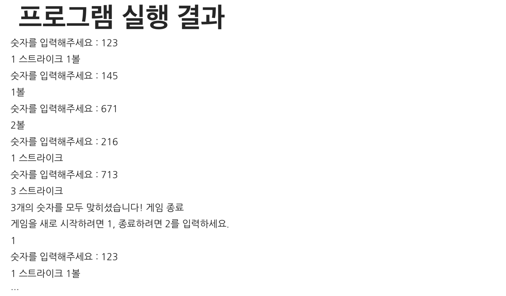
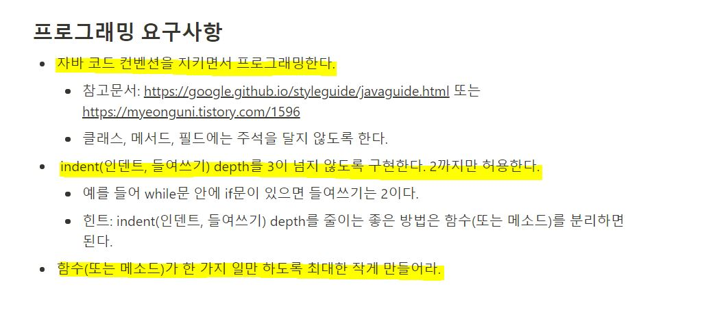

# java-baseball
# 숫자야구게임 저장소
+ 기본적으로 1부터 9까지 서로 다른 수로 이루어진 3자리의 수를 맞추는 게임이다.  

+ 같은 수가 같은 자리에 있으면 스트라이크, 다른 자리에 있으면 볼, 같은 수가 전혀 없으면 포볼 또는 낫싱이라는 힌트를 얻고,
  그 힌트를 이용해서 먼저 상대방(컴퓨터)의 수를 맞추면 승리한다.  
    +예) 상대방의 수가 425일 때, 123을 제시한 경우: 1 스트라이크, 456을 제시한 경우: 1 스트라이크 1볼, 789를 제시한 경우: 낫싱  
    
+ 위 숫자 야구게임에서 상대방의 역할을 컴퓨터가 한다. 컴퓨터는 1에서 9까지 서로 다른 임의의 수 3개를 선택한다. 게임 플레이어는 컴퓨터가 생각하고
  있는 3개의 숫자를 입력하고, 컴퓨터는 입력한 숫자에 대한 결과를 출력한다.
  
+ 이 같은 과정을 반복해 컴퓨터가 선택한 3개의 숫자를 모두 맞히면 게임이 종료된다.

+ 게임을 종료한 후 게임을 다시 시작하거나 완전히 종료할 수 있다.

## 구현해야할 기능 목록
+ 난수 생성
+ 사용자 입력을 토대로 스트라이크, 볼을 계산해주는 함수.
+ 위의 함수 결과값을 토대로 출력해주는 함수.
+ 게임 한 사이클을 실행하는 함수(난수생성 ~ 사용자가 난수를 맞힐 때까지)
